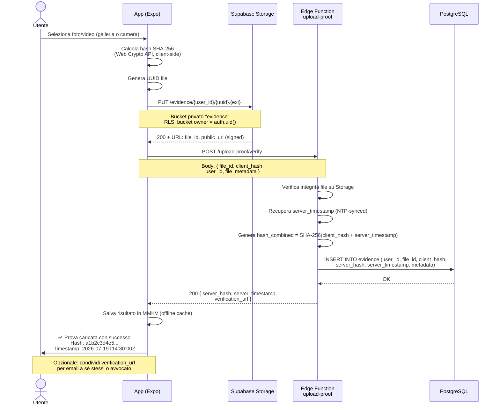
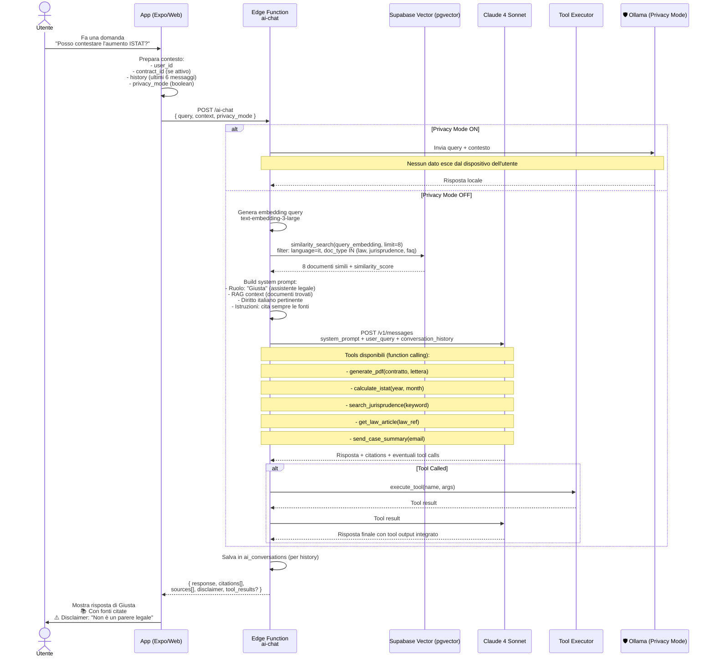
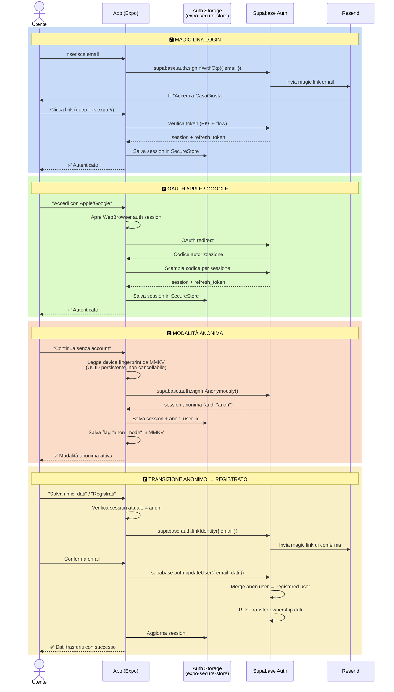
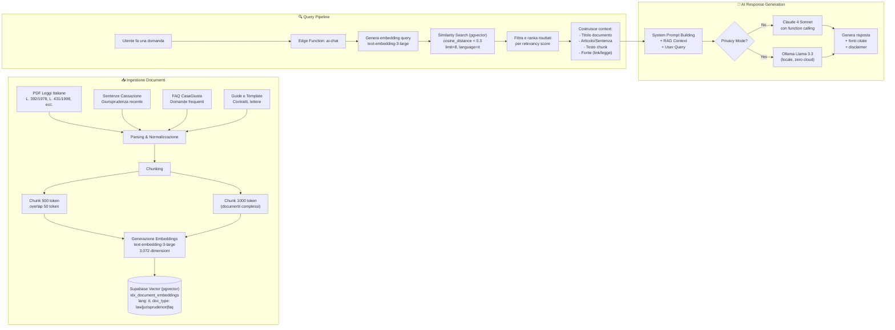
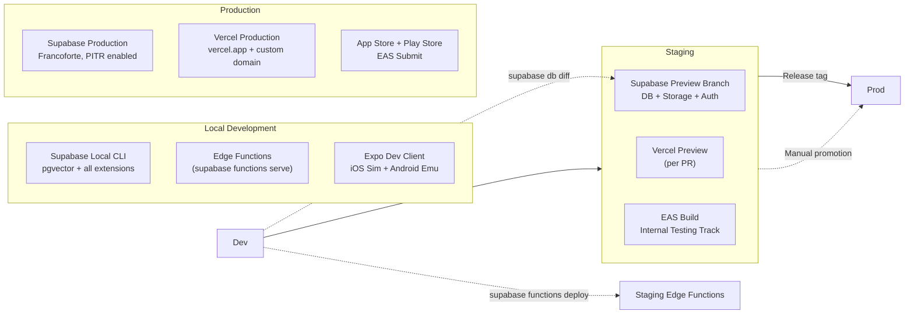
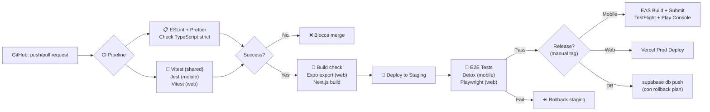

# 03 — Architettura Tecnica — CasaGiusta

> **Versione:** 1.0.0  
> **Stato:** Bozza iniziale  
> **Ultimo aggiornamento:** Luglio 2026

---

## 1. Visione Architetturale

### 1.1 Principi Fondanti

CasaGiusta è una piattaforma **AI-native, mobile-first, privacy-first** progettata per tutelare gli inquilini italiani attraverso strumenti digitali, assistenza legale intelligente e una knowledge base basata sul diritto locatizio italiano.

**Principi architetturali:**

| Principio | Descrizione |
|---|---|
| **Mobile-first** | L'esperienza primaria è su smartphone (Expo/React Native). Web companion e admin sono secondari. |
| **AI-native** | L'assistente "Giusta" è il cuore dell'app. RAG su documenti legali italiani, function calling per azioni (generare PDF, calcolare ISTAT, cercare giurisprudenza). |
| **Privacy-first** | Crittografia end-to-end opzionale per i documenti sensibili. Modalità anonima senza registrazione. Modalità privacy con LLM locale (Ollama). Zero-knowledge architecture dove possibile. |
| **Offline-resilient** | La maggior parte delle funzionalità deve funzionare offline o con connessione intermittente. |
| **Serverless-first** | Backend serverless (Supabase + Edge Functions). Nessun server da gestire. |
| **Regulatory compliant** | GDPR, diritto italiano locatizio (L. 431/1998, L. 392/1978, D.L. 145/2013, ecc.). |

### 1.2 Schema Architetturale Generale

```
┌─────────────────────────────────────────────────────────────────┐
│                        CLIENT LAYER                             │
│  ┌─────────────────────┐  ┌──────────────────┐  ┌────────────┐ │
│  │  Mobile App (Expo)  │  │  Web Companion   │  │  Admin     │ │
│  │  iOS + Android      │  │  Next.js 15      │  │  Next.js   │ │
│  │  OTA via EAS Update │  │  (Desktop/Tablet)│  │  Dashboard │ │
│  └────────┬────────────┘  └────────┬─────────┘  └──────┬─────┘ │
│           │                        │                    │       │
└───────────┼────────────────────────┼────────────────────┼───────┘
            │                        │                    │
            │  ┌──────────────────────────────────────┐   │
            │  │         CLOUDFLARE / VERCEL          │   │
            │  │  DNS, CDN, SSL, Edge Caching         │   │
            │  └──────────────────────────────────────┘   │
            │                        │                    │
┌───────────┼────────────────────────┼────────────────────┼───────┐
│           ▼                        ▼                    ▼       │
│                     SUPABASE ECOSYSTEM                          │
│  ┌─────────────────────────────────────────────────────────┐   │
│  │  PostgreSQL 16 (Frankfurt Region)                       │   │
│  │  ┌──────────┐ ┌──────────┐ ┌──────────┐ ┌──────────┐  │   │
│  │  │  Auth    │ │ Storage  │ │ Realtime │ │ Vector   │  │   │
│  │  │ (GoTrue) │ │ (S3)     │ │(WebSocket)│ │(pgvector)│  │   │
│  │  └──────────┘ └──────────┘ └──────────┘ └──────────┘  │   │
│  └─────────────────────────────────────────────────────────┘   │
│                                                                │
│  ┌─────────────────────────────────────────────────────────┐   │
│  │  Edge Functions (Deno) — AI Orchestration Layer          │   │
│  │  ┌─────────────┐ ┌──────────────┐ ┌──────────────────┐ │   │
│  │  │ ai-chat     │ │ upload-proof │ │ generate-pdf     │ │   │
│  │  │ (RAG+Claude)│ │ (hash+verify)│ │ (contratti/lettere│ │   │
│  │  └─────────────┘ └──────────────┘ └──────────────────┘ │   │
│  │  ┌─────────────┐ ┌──────────────┐ ┌──────────────────┐ │   │
│  │  │ istat-calc  │ │ jurisprudence│ │ ocr-proxy        │ │   │
│  │  │ (ISTAT wave)│ │ (search law) │ │ (vision+teseract)│ │   │
│  │  └─────────────┘ └──────────────┘ └──────────────────┘ │   │
│  └─────────────────────────────────────────────────────────┘   │
└─────────────────────────────────────────────────────────────────┘

┌─────────────────────────────────────────────────────────────────┐
│                    EXTERNAL SERVICES LAYER                       │
│  ┌──────────┐ ┌──────────┐ ┌──────────┐ ┌──────────────────┐  │
│  │ Anthropic│ │ OpenAI   │ │ Ollama   │ │ Google Vision    │  │
│  │ Claude 4 │ │ GPT-4.1  │ │ Llama 3.3│ │ (OCR Cloud)      │  │
│  └──────────┘ └──────────┘ └──────────┘ └──────────────────┘  │
│  ┌──────────┐ ┌──────────┐ ┌──────────┐ ┌──────────────────┐  │
│  │ Resend   │ │ Stripe   │ │ Revenue  │ │ PostHog          │  │
│  │ (Email)  │ │ (Payment)│ │ Cat      │ │ (Analytics)      │  │
│  └──────────┘ └──────────┘ └──────────┘ └──────────────────┘  │
│  ┌──────────┐ ┌──────────┐                                     │
│  │ OneSignal│ │ Sentry   │                                     │
│  │ (Push)   │ │ (Errors) │                                     │
│  └──────────┘ └──────────┘                                     │
└─────────────────────────────────────────────────────────────────┘
```

---

## 2. Stack Tecnologico Definitivo

### 2.1 Frontend Mobile (Priorità Assoluta)

| Componente | Tecnologia | Versione | Note |
|---|---|---|---|
| Framework | Expo SDK | 53+ | Managed workflow con dev build per moduli nativi |
| React Native | React Native | 0.79+ | New Architecture (Fabric + TurboModules) abilitata |
| Linguaggio | TypeScript | 5.6+ | Strict mode, `noUncheckedIndexedAccess` |
| Routing | Expo Router | v4 | File-based routing, deep linking nativo |
| Styling | NativeWind | v4 | Tailwind CSS per React Native, utility-first |
| State management | Zustand | 5.x | Store leggeri per UI state |
| Server state | TanStack Query | v5 | Cache, optimistic updates, infinite scroll |
| Persistence | MMKV | 1.x | Storage performante (10x più veloce di AsyncStorage) |
| Secure storage | expo-secure-store | ~13.x | Keychain/Keystore per token, biometrics |
| Notifiche push | expo-notifications + OneSignal | latest | Push locali e remote, silenziose, rich media |
| OTA Updates | EAS Update | latest | Hotfix e aggiornamenti senza App Store review |
| Camera | expo-camera + vision-camera | latest | OCR su device con frame processor |
| Documenti | expo-document-picker + react-native-pdf | latest | Upload contratti, visure, PDF viewer |
| Immagini | expo-image-picker + expo-file-system | latest | Acquisizione e caching immagini |
| Animazioni | react-native-reanimated | 3.x | 60fps UI thread animations |
| Gesture | react-native-gesture-handler | 2.x | Swipe, pinch, drag-and-drop |
| Maps | react-native-maps | latest | Geolocalizzazione immobili |
| Biometrics | expo-local-authentication | latest | Sblocco app con fingerprint/FaceID |
| Haptics | expo-haptics | latest | Feedback tattile |
| Splash screen | exppo-splash-screen | latest | Splash screen personalizzato |
| Deep linking | expo-linking | latest | Universal links + custom schemes |

### 2.2 Web Companion + Admin + Landing

| Componente | Tecnologia | Versione | Note |
|---|---|---|---|
| Framework | Next.js | 15.x | App Router, React Server Components |
| React | React | 19.x | Server Actions, `use()` hook |
| Linguaggio | TypeScript | 5.6+ | Strict mode |
| Styling | Tailwind CSS | 4.x | Utility-first |
| Componenti | shadcn/ui | latest | Radix UI + Tailwind, accessibili |
| Animazioni | Framer Motion | 11.x | Layout animations, page transitions |
| Auth lato web | @supabase/supabase-js + @supabase/ssr | latest | SSR-compatible auth helpers |
| Deploy | Vercel | — | Edge Functions, ISR, static export per landing |

### 2.3 Backend & Database

| Componente | Tecnologia | Versione | Note |
|---|---|---|---|
| Database | PostgreSQL (Supabase) | 16.x | Con pgvector, pg_stat_statements, pg_graphql |
| ORM/Query | Supabase JS Client | 2.x | +raw SQL per query complesse |
| Auth | Supabase Auth (GoTrue) | latest | Magic link, OAuth, JWT, RLS |
| Storage | Supabase Storage | latest | Buckets pubblici/privati, signed URLs, transformations |
| Realtime | Supabase Realtime | latest | WebSocket per chat e notifiche live |
| Vector DB | pgvector | 0.8+ | Similarità semantica per RAG |
| Edge Functions | Deno (Supabase) | 2.x | TypeScript runtime, ~10ms cold start |
| Migrazioni | Supabase CLI + pg_migrate | latest | Versionate, rollback support |

### 2.4 AI Layer

| Componente | Tecnologia | Note |
|---|---|---|
| **LLM Primario** | Claude 4 Sonnet (Anthropic API) | Bilanciamento qualità/velocità |
| **LLM Premium** | Claude 4 Opus (Anthropic API) | Documenti complessi, generazione contratti |
| **LLM Fallback** | GPT-4.1 (OpenAI API) | Se Claude non disponibile |
| **LLM Fallback 2** | Gemini 2.5 Pro (Google AI) | Backup secondario |
| **Embeddings** | text-embedding-3-large (OpenAI) | 3072 dimensioni, migliore accuratezza |
| **Privacy Mode** | Ollama + Llama 3.3 70B (locale) | Nessun dato esce dal dispositivo |
| **OCR Cloud** | Google Cloud Vision API | Riconoscimento documenti scannerizzati |
| **OCR Fallback** | Tesseract.js (WASM, browser/device) | Offline, senza API key |

### 2.5 Auth & Identity

| Modalità | Tecnologia | Note |
|---|---|---|
| Magic Link | Supabase Auth (email) | Login senza password, link via Resend |
| OAuth Apple | Sign in with Apple (Supabase) | Obbligatorio per iOS |
| OAuth Google | Google Sign-In (Supabase) | Predefinito per Android/web |
| Anonima | Supabase anonymous sign-in | Device fingerprint + UUID persistente |
| Registrata | Transizione da anonima a email/OAuth | Merge dati anonimi in account registrato |
| **Futuro: SPID/CIE** | OpenID Connect + SPID.gov.it | Identità digitale italiana |

### 2.6 Storage & Media

| Componente | Tecnologia | Note |
|---|---|---|
| Primary storage | Supabase Storage (S3-compatibile) | 3 bucket: `evidence`, `contracts`, `avatars` |
| Cold backup | Cloudflare R2 | Backup giornaliero automatico |
| OCR images | Google Cloud Vision + Tesseract | Cloud per qualità, locale per privacy |
| Hash verification | SHA-256 (Web Crypto API + server) | Doppio hash (client + server timestamp) |
| Image optimization | Supabase Storage transformations | Resize, WebP, AVIF automatici |
| Max upload | 20MB per file (video: 100MB) | Validato client-side e server-side |

### 2.7 Servizi Aggiuntivi

| Servizio | Ruolo | Integrazione |
|---|---|---|
| **Resend** | Email transazionali (magic link, notifiche, reminder) | SDK React Email + Edge Function |
| **OneSignal** | Push notifications (quando app in background) | SDK React Native + REST API |
| **Expo Push** | Push notifications (quando app in foreground) | expo-notifications integrato |
| **PostHog** | Analytics, feature flags, session replay | SDK React Native + Next.js |
| **Sentry** | Error tracking, performance monitoring | SDK React Native + Next.js + Deno |
| **RevenueCat** | Subscription management (in-app purchase) | SDK React Native + webhook Stripe |
| **Stripe** | Pagamenti one-shot (consulenze, documenti) | Stripe Elements + Checkout + webhook |

---

## 3. Diagrammi Mermaid

### 3.1 Architettura Generale — Diagramma dei Componenti

```mermaid
graph TB
    subgraph "Client Layer"
        Mobile["📱 Mobile App (Expo)"]
        WebCompanion["🌐 Web Companion (Next.js 15)"]
        Admin["🔐 Admin Dashboard (Next.js)"]
    end

    subgraph "Supabase Cloud"
        subgraph "PostgreSQL 16"
            AuthDB[("Auth (GoTrue)")]
            MainDB[("Main DB")]
            VectorDB[("Vector Store pgvector)")]
        end
        Storage[("📦 Supabase Storage")]
        Realtime["⚡ Realtime WebSocket"]

        subgraph "Edge Functions (Deno)"
            EF_Chat["ai-chat"]
            EF_Proof["upload-proof"]
            EF_PDF["generate-pdf"]
            EF_ISTAT["istat-calc"]
            EF_Juris["jurisprudence-search"]
            EF_OCR["ocr-proxy"]
        end
    end

    subgraph "External AI"
        Claude["Anthropic Claude 4 Sonnet/Opus"]
        OpenAI["OpenAI GPT-4.1"]
        Gemini["Google Gemini 2.5 Pro"]
        Ollama["🛡️ Ollama Llama 3.3<br/>(Privacy Mode - Locale)"]
    end

    subgraph "External Services"
        Resend["📧 Resend"]
        Stripe["💳 Stripe + RevenueCat"]
        PostHog["📊 PostHog"]
        Sentry["🐛 Sentry"]
        OneSignal["🔔 OneSignal"]
        GoogleVision["👁️ Google Cloud Vision"]
    end

    Mobile -- "Supabase JS Client (RLS direct)" --> AuthDB
    Mobile -- "CRUD + Realtime" --> MainDB
    Mobile -- "Upload/Download" --> Storage
    Mobile -- "AI Requests" --> EF_Chat
    Mobile -- "Proof Upload" --> EF_Proof
    Mobile -- "PDF Generation" --> EF_PDF

    WebCompanion -- "SSR Auth + Queries" --> AuthDB
    WebCompanion -- "Read/Write" --> MainDB
    Admin -- "Admin RLS bypass" --> MainDB

    EF_Chat --> VectorDB
    EF_Chat --> Claude
    EF_Chat --> OpenAI
    EF_Chat --> Gemini
    EF_Chat -.-> Ollama

    EF_Proof --> MainDB
    EF_PDF --> MainDB
    EF_ISTAT --> MainDB
    EF_Juris --> MainDB
    EF_OCR --> GoogleVision

    EF_Chat -- "Email notifications" --> Resend
    Mobile -- "Push" --> OneSignal
    Mobile -- "Analytics" --> PostHog
    All["All Layers"] -- "Errors" --> Sentry
    Mobile -- "Payments" --> Stripe
```



### 3.2 Flusso Dati — Upload Prova con Timestamp



### 3.3 Flusso Dati — AI Assistant "Giusta"



### 3.4 Diagramma Database — Entità Relazioni

```mermaid
erDiagram
    users ||--o| profiles : "1:1"
    users ||--o{ contracts : "1:N"
    users ||--o{ cases : "1:N"
    users ||--o{ ai_conversations : "1:N"
    users ||--o{ subscriptions : "1:N"
    users ||--o{ community_posts : "1:N"

    profiles {
        uuid id PK
        uuid user_id FK "UNIQUE"
        string full_name
        string phone
        date date_of_birth
        string fiscal_code "Codice Fiscale"
        string avatar_url
        string privacy_mode "off | on | strict"
        boolean is_lawyer
        jsonb lawyer_profile "only if is_lawyer"
        timestamptz created_at
        timestamptz updated_at
    }

    contracts {
        uuid id PK
        uuid user_id FK
        string type "Abitativo | Commerciale | Transitorio"
        string status "Active | Expired | Disputed | Terminated"
        string property_address
        string city
        string postal_code
        decimal monthly_rent
        decimal deposit_amount
        date start_date
        date end_date
        date renewal_date
        string contract_file_url "PDF in Supabase Storage"
        string cadastral_data "Dati catastali"
        string landlord_name
        string landlord_contact
        boolean has_istat_revision
        timestamptz created_at
        timestamptz updated_at
    }

    evidence {
        uuid id PK
        uuid user_id FK
        uuid contract_id FK "nullable"
        uuid case_id FK "nullable"
        string file_type "image | video | audio | document"
        string file_url "Signed URL"
        integer file_size_bytes
        string client_hash "SHA-256 client-side"
        string server_hash "SHA-256 combined"
        timestamptz server_timestamp "NTP-synced"
        string mime_type
        jsonb metadata "EXIF, GPS, device info"
        boolean is_deleted "Soft delete"
        timestamptz created_at
        timestamptz deleted_at
    }

    cases {
        uuid id PK
        uuid user_id FK
        string title
        string type "Mancata restituzione cauzione | Aumento ISTAT illegittimo | Morosità | Vizi dell'immobile | Disdetta | Altro"
        string status "Open | InProgress | WithLawyer | Resolved | Closed"
        text description
        string priority "Low | Medium | High | Urgent"
        decimal claimed_amount "Importo richiesto"
        decimal obtained_amount "Importo ottenuto (se risolto)"
        uuid assigned_lawyer_id FK "nullable"
        jsonb timeline "Array di eventi con timestamp"
        timestamptz created_at
        timestamptz updated_at
        timestamptz resolved_at
    }

    ai_conversations {
        uuid id PK
        uuid user_id FK
        uuid contract_id FK "nullable"
        uuid case_id FK "nullable"
        integer message_count
        jsonb metadata "privacy_mode, model_used, tokens_used"
        timestamptz created_at
    }

    ai_messages {
        uuid id PK
        uuid conversation_id FK
        string role "user | assistant | system | tool"
        text content
        jsonb citations "[]"
        jsonb tool_calls "[]"
        jsonb tool_results "[]"
        integer tokens_in
        integer tokens_out
        timestamptz created_at
    }

    templates_generated {
        uuid id PK
        uuid user_id FK
        uuid contract_id FK "nullable"
        string type "Lettera raccomandata | Diffida | Richiesta cauzione | Disdetta | Altro"
        string title
        text content "Markdown/HTML"
        string pdf_url "Generated PDF in Storage"
        jsonb fields "Campi compilati"
        timestamptz created_at
    }

    lawyers_partners {
        uuid id PK
        uuid user_id FK "Riferimento a users"
        string studio_name
        string address
        string city
        string region
        string specializations[] "Array di specializzazioni"
        decimal rating "Media recensioni"
        integer review_count
        jsonb availability "Calendario"
        boolean is_verified "Verificato da CasaGiusta"
        decimal consultation_fee
        timestamptz created_at
    }

    community_posts {
        uuid id PK
        uuid user_id FK
        string title
        text content
        string category "Domanda | Esperienza | Consiglio | Segnalazione"
        tag tags[]
        integer upvotes
        integer comment_count
        boolean is_pinned
        boolean is_resolved
        timestamptz created_at
        timestamptz updated_at
    }

    subscriptions {
        uuid id PK
        uuid user_id FK "UNIQUE"
        string plan "Free | Plus | Pro"
        string provider "revenuecat | stripe"
        string provider_subscription_id
        string status "Active | PastDue | Cancelled | Expired"
        date current_period_start
        date current_period_end
        jsonb features "feature flags basate su piano"
        timestamptz created_at
        timestamptz updated_at
    }
```



### 3.5 Diagramma Auth — Multi-Modalità



### 3.6 Flusso RAG — Knowledge Base



---

## 4. Decisioni Architetturali (ADR)

### ADR-001: Database su Supabase (non self-hosted)

- **Context:** Abbiamo bisogno di un database relazionale con auth integrato, storage, realtime e vector search. Opzioni: Supabase (managed), self-hosted PostgreSQL + estensioni, PlanetScale, Neon. Self-hosted richiederebbe gestire auth server, storage server, realtime server, vector extension separatamente.
- **Decision:** Supabase su cloud (regione Francoforte). Piano Pro iniziale, poi Scale se necessario.
- **Conseguenze:**
  - ✅ Time-to-market drasticamente ridotto (auth, storage, realtime, vector già integrati)
  - ✅ Zero operations overhead (backup, scaling, security patches gestiti da Supabase)
  - ✅ RLS applicabile su tutti i dati, compresi storage e vector
  - ⚠️ Vendor lock-in medio (PostgreSQL standard, migrabile in futuro)
  - ⚠️ Costi crescenti con l'aumento del database size
  - ⚠️ Limite connection pooling su piano Pro (200 pooler connections)

### ADR-002: RAG su pgvector vs Chroma/Pinecone

- **Context:** Knowledge base di ~500 documenti legali italiani (leggi, sentenze, guide, FAQ). Necessità di similarità semantica con filtri per metadata (tipo documento, lingua, data). Opzioni: pgvector su Supabase, Pinecone, ChromaDB, Weaviate.
- **Decision:** pgvector su Supabase.
- **Conseguenze:**
  - ✅ Zero infrastruttura extra — stesso database già usato per tutto
  - ✅ RLS applicabile direttamente sulle ricerche vettoriali
  - ✅ Performance eccellente fino a 100k+ documenti (con HNSW index)
  - ✅ Transazioni ACID: atomicità tra salvataggio chunk e embeddings
  - ⚠️ Query full-text ibride richiedono più lavoro manuale (pgvector + pg_search)
  - ⚠️ Scaling oltre 1M documenti richiederebbe tuning o migrazione

### ADR-003: Edge Functions (Deno) vs Serverless Node.js

- **Context:** AI orchestration, PDF generation, webhook handling, OCR proxy. Opzioni: Supabase Edge Functions (Deno), Vercel Functions (Node.js), AWS Lambda.
- **Decision:** Doppio binario: Edge Functions (Deno) per orchestrazione AI e operazioni sensibili; Next.js API Routes (Node.js) per CRUD e webhook Stripe.
- **Conseguenze:**
  - ✅ Edge Functions hanno cold start ~10ms (vs 200-500ms Lambda)
  - ✅ Deno è più sicuro di Node.js (no `require`, sandbox di default)
  - ✅ Integrazione nativa con Supabase (auth context già iniettato)
  - ⚠️ Ecosistema Deno più piccolo (alcune librerie Node.js non compatibili)
  - ⚠️ Edge Functions hanno timeout 5 minuti e memory 1GB (sufficiente per AI)

### ADR-004: Expo (Managed + EAS) vs React Native CLI

- **Context:** Team piccolo, necessità di iterare velocemente, OTA updates, distribuzione su iOS e Android. Opzioni: Expo managed workflow, Expo dev build, React Native CLI (bare workflow).
- **Decision:** Expo managed workflow con EAS Build per dev build quando necessario.
- **Conseguenze:**
  - ✅ OTA Updates con EAS Update: hotfix senza passare da App Store
  - ✅ Expo SDK include 70% dei moduli necessari già preconfigurati
  - ✅ Expo Router v4 offre file-based routing con deep linking nativo
  - ✅ EAS Build gestisce certificati, provisioning, e submission
  - ⚠️ Moduli nativi non supportati da Expo richiedono dev build (vision-camera, react-native-pdf)
  - ⚠️ Expo SDK ha un lieve ritardo (qualche mese) rispetto a RN core releases

### ADR-005: Client-direct Supabase vs Backend API Layer

- **Context:** Il frontend necessita di leggere/scrivere dati. Opzioni: client Supabase diretto (anteriori key + RLS), backend API intermedio (tutte le richieste passano da un server), ibrido.
- **Decision:** Misto — client Supabase diretto per auth, storage, CRUD semplice; Edge Functions per AI, operazioni sensibili, e transazioni complesse.
- **Conseguenze:**
  - ✅ Meno boilerplate: RLS sostituisce 80% delle API CRUD tradizionali
  - ✅ Performance: latenza ridotta (chiamate dirette, senza hop intermedio)
  - ✅ Offline-first: client Supabase ha caching e retry built-in
  - ⚠️ RLS va progettata con estrema attenzione (security-by-design)
  - ⚠️ Operazioni complesse (transazioni multi-tabella) meglio in Edge Functions

### ADR-006: Scelta LLM Primario — Claude 4 Sonnet vs GPT-4.1

- **Context:** L'assistente legale "Giusta" deve rispondere in italiano giuridico, citare fonti, chiamare tools. Opzioni: Claude 4 Sonnet, Claude 3.5 Sonnet, GPT-4.1, Gemini 2.5 Pro.
- **Decision:** Claude 4 Sonnet come primario per il rapporto qualità/velocità/costo. Claude 4 Opus per documenti complessi. Fallback automatico su GPT-4.1 in caso di outage Anthropic.
- **Conseguenze:**
  - ✅ Claude 4 Sonnet è superiore in italiano giuridico e capacità di citare fonti
  - ✅ Supporto nativo per function calling e tool use
  - ✅ API Anthropic più affidabile di OpenAI in contesto EU (nessun data training)
  - ⚠️ Costo: ~$3/1M input tokens, ~$15/1M output tokens (Sonnet)
  - ⚠️ Rate limit più bassi di OpenAI su piano standard

---

## 5. Struttura Progetto

```
casagiusta/
│
├── apps/
│   ├── mobile/                        # 🏆 App mobile (Expo) — PRIORITÀ 1
│   │   ├── app/                       # Expo Router (file-based routing)
│   │   │   ├── (auth)/                # Auth screens group
│   │   │   │   ├── login.tsx
│   │   │   │   ├── register.tsx
│   │   │   │   └── anonymous.tsx
│   │   │   ├── (tabs)/                # Tab navigation group
│   │   │   │   ├── _layout.tsx
│   │   │   │   ├── index.tsx          # Home/Dashboard
│   │   │   │   ├── contratti.tsx      # Contracts list
│   │   │   │   ├── prove.tsx          # Evidence gallery
│   │   │   │   ├── giusta.tsx         # AI chat "Giusta"
│   │   │   │   └── profilo.tsx        # Profile & settings
│   │   │   ├── contratto/
│   │   │   │   ├── [id].tsx           # Contract detail
│   │   │   │   └── nuovo.tsx          # New contract form
│   │   │   ├── caso/
│   │   │   │   ├── [id].tsx           # Case detail & timeline
│   │   │   │   └── nuovo.tsx          # New case (guided wizard)
│   │   │   ├── prova/
│   │   │   │   └── [id].tsx           # Evidence detail with hash
│   │   │   ├── avvocati/
│   │   │   │   ├── index.tsx          # Lawyers directory
│   │   │   │   └── [id].tsx           # Lawyer profile
│   │   │   ├── community/
│   │   │   │   ├── index.tsx          # Forum/Community
│   │   │   │   └── [id].tsx           # Post detail
│   │   │   ├── pdf/
│   │   │   │   └── [id].tsx           # PDF viewer
│   │   │   ├── impostazioni.tsx       # Settings
│   │   │   └── abbonamento.tsx        # Subscription management
│   │   │
│   │   ├── components/                # UI Components
│   │   │   ├── ui/                    # Base UI (button, input, card, modal...)
│   │   │   ├── contract/              # Contract-specific components
│   │   │   ├── evidence/              # Evidence-specific components
│   │   │   ├── chat/                  # Chat components (message list, input...)
│   │   │   └── lawyer/                # Lawyer directory components
│   │   │
│   │   ├── features/                  # Feature modules (domain logic)
│   │   │   ├── auth/                  # Auth feature (hooks, API, stores)
│   │   │   ├── contracts/             # Contracts feature
│   │   │   ├── evidence/              # Evidence feature
│   │   │   ├── cases/                 # Cases feature
│   │   │   ├── ai/                    # AI chat feature
│   │   │   └── community/             # Community feature
│   │   │
│   │   ├── hooks/                     # Global custom hooks
│   │   │   ├── useAuth.ts
│   │   │   ├── useOffline.ts
│   │   │   ├── useSecureStore.ts
│   │   │   └── useAnonMode.ts
│   │   │
│   │   ├── lib/                       # Utilities e config
│   │   │   ├── supabase.ts            # Supabase client config
│   │   │   ├── api.ts                 # Edge Functions client
│   │   │   ├── crypto.ts              # SHA-256, encryption utils
│   │   │   ├── i18n.ts                # Italian localization
│   │   │   ├── constants.ts
│   │   │   └── types.ts
│   │   │
│   │   ├── providers/                 # Context providers
│   │   │   ├── AuthProvider.tsx
│   │   │   ├── ThemeProvider.tsx
│   │   │   ├── OfflineProvider.tsx
│   │   │   └── QueryProvider.tsx
│   │   │
│   │   └── assets/                    # Static assets (images, fonts)
│   │       ├── icons/
│   │       └── fonts/
│   │
│   ├── web/                           # 🌐 Web Companion (Next.js 15)
│   │   ├── app/                       # App Router
│   │   │   ├── page.tsx               # Landing page
│   │   │   ├── login/
│   │   │   ├── dashboard/
│   │   │   ├── contratti/
│   │   │   ├── prove/
│   │   │   ├── giusta/
│   │   │   └── community/
│   │   ├── components/
│   │   ├── lib/
│   │   └── public/
│   │
│   └── admin/                         # 🔐 Admin Dashboard (Next.js 15)
│       ├── app/
│       │   ├── login/
│       │   ├── dashboard/
│       │   ├── users/
│       │   ├── contracts/
│       │   ├── lawyers/
│       │   └── analytics/
│       └── lib/
│
├── packages/                          # Shared packages (monorepo)
│   ├── shared/                        # Types, validation, utilities
│   │   ├── src/
│   │   │   ├── types/                 # Shared TypeScript types
│   │   │   │   ├── user.ts
│   │   │   │   ├── contract.ts
│   │   │   │   ├── evidence.ts
│   │   │   │   ├── case.ts
│   │   │   │   └── ai.ts
│   │   │   ├── validation/            # Zod schemas (client + server)
│   │   │   │   ├── contract.ts
│   │   │   │   ├── evidence.ts
│   │   │   │   └── auth.ts
│   │   │   └── utils/
│   │   │       ├── dates.ts
│   │   │       ├── format.ts
│   │   │       └── istat.ts           # ISTAT calculation logic
│   │   └── package.json
│   │
│   ├── ai/                            # AI prompts, tools, RAG config
│   │   ├── src/
│   │   │   ├── prompts/               # System prompts per use case
│   │   │   │   ├── giusta.ts          # Main assistant prompt
│   │   │   │   ├── contract-gen.ts    # Contract generation prompt
│   │   │   │   └── rag-system.ts      # RAG system prompt template
│   │   │   ├── tools/                 # Function calling definitions
│   │   │   │   ├── generate-pdf.ts
│   │   │   │   ├── calculate-istat.ts
│   │   │   │   ├── search-jurisprudence.ts
│   │   │   │   └── send-email.ts
│   │   │   ├── rag/                   # RAG pipeline
│   │   │   │   ├── chunking.ts
│   │   │   │   ├── embeddings.ts
│   │   │   │   └── search.ts
│   │   │   └── models.ts              # Model config & fallback logic
│   │   └── package.json
│   │
│   └── config/                        # Shared configurations
│       ├── tailwind-preset.ts
│       ├── eslint-preset.js
│       └── tsconfig.base.json
│
├── supabase/                          # Supabase configuration
│   ├── migrations/                    # Database migrations
│   │   ├── 001_users_profiles.sql
│   │   ├── 002_contracts.sql
│   │   ├── 003_evidence.sql
│   │   ├── 004_cases.sql
│   │   ├── 005_ai_conversations.sql
│   │   ├── 006_templates.sql
│   │   ├── 007_lawyers_partners.sql
│   │   ├── 008_community.sql
│   │   ├── 009_subscriptions.sql
│   │   └── 010_vector_index.sql
│   │
│   ├── functions/                     # Edge Functions
│   │   ├── ai-chat/                   # AI assistant "Giusta"
│   │   │   ├── index.ts
│   │   │   ├── prompts.ts
│   │   │   ├── tools.ts
│   │   │   └── rag.ts
│   │   ├── upload-proof/              # Upload with timestamp & hash
│   │   │   ├── index.ts
│   │   │   └── verify.ts
│   │   ├── generate-pdf/              # PDF generation
│   │   │   ├── index.ts
│   │   │   └── templates/
│   │   ├── istat-calc/                # ISTAT calculation
│   │   │   └── index.ts
│   │   ├── jurisprudence-search/      # Giurisprudenza search
│   │   │   └── index.ts
│   │   └── ocr-proxy/                 # OCR proxy (Vision API + Tesseract)
│   │       └── index.ts
│   │
│   ├── seed.sql                       # Seed data (demo contracts, FAQ)
│   └── config.toml                    # Supabase project config
│
├── docs/                              # Documentation
│   ├── 01_VISIONE.md
│   ├── 02_REQUISITI.md
│   ├── 03_ARCHITETTURA.md             # ← Questo file
│   ├── 04_RAG_KNOWLEDGE_BASE.md
│   ├── 05_RLS_POLICIES.md
│   └── 06_API_REFERENCE.md
│
├── .github/
│   ├── workflows/
│   │   ├── ci.yml                     # Lint, typecheck, test
│   │   ├── deploy-mobile.yml          # EAS Build + Submit
│   │   └── deploy-web.yml             # Vercel deploy
│   └── CODEOWNERS
│
├── turbo.json                         # Turborepo config
├── package.json                       # Workspaces root
├── tsconfig.json                      # Root TS config
├── .env.example                       # Environment variables template
├── .env.local                         # Local env (gitignored)
├── .gitignore
├── .prettierrc
├── .eslintrc.js
└── README.md
```

---

## 6. Privacy e Sicurezza

### 6.1 RLS Policies (Row Level Security)

Tutte le tabelle del database hanno RLS abilitato. Principi:

```sql
-- Ogni utente vede solo i propri dati
CREATE POLICY "Users can view own evidence" ON evidence
  FOR SELECT
  USING (auth.uid() = user_id);

-- Admin (ruolo 'admin') può vedere tutto
CREATE POLICY "Admins can view all evidence" ON evidence
  FOR SELECT
  USING (auth.jwt() ->> 'role' = 'admin');

-- Insert: solo con proprio user_id
CREATE POLICY "Users can insert own evidence" ON evidence
  FOR INSERT
  WITH CHECK (auth.uid() = user_id);

-- Storage: bucket privato con RLS
CREATE POLICY "Users can view own evidence files" ON storage.objects
  FOR SELECT
  USING (auth.uid() = (storage.foldername(name))[1]::uuid);
```

### 6.2 Crittografia

| Layer | Tecnica | Dove |
|---|---|---|
| In-transit | TLS 1.3 | Tutte le comunicazioni |
| At-rest (server) | AES-256 (PostgreSQL TDE) | Database Supabase |
| At-rest (storage) | AES-256 (S3 server-side) | Supabase Storage |
| **Client-side (optional)** | **AES-256-GCM** con chiave derivata da PIN/biometria | Vault documenti sensibili |

La crittografia client-side funziona così:
1. Utente imposta un PIN o usa biometria
2. Chiave derivata con PBKDF2 (100k iterazioni, salt casuale)
3. File criptati prima dell'upload: `encrypt(file, key) → upload(bytes)`
4. Solo chunk decriptati on-device per la visione
5. Chiave mai inviata al server

### 6.3 Data Residency

- **Database:** Supabase Francoforte (eu-central-1)
- **Cold backup:** Cloudflare R2 (eu-west)
- **AI API:** Claude/OpenAI processano dati in US (solo query non sensibili)
- **Privacy mode:** Nessun dato esce dal dispositivo

### 6.4 Audit Logging

Tutte le operazioni sensibili vengono loggate in una tabella `audit_logs`:

```sql
CREATE TABLE audit_logs (
  id UUID PRIMARY KEY DEFAULT gen_random_uuid(),
  user_id UUID REFERENCES users(id),
  action TEXT NOT NULL,           -- 'evidence.upload', 'ai.chat', 'contract.delete'
  resource_type TEXT NOT NULL,    -- 'evidence', 'contract', 'case'
  resource_id UUID,
  metadata JSONB,                 -- Dettagli operazione
  ip_address INET,
  user_agent TEXT,
  created_at TIMESTAMPTZ DEFAULT now()
);
```

Retention: 12 mesi (poi archiviazione cold su R2).

### 6.5 Zero Knowledge Architecture

Dove possibile, il server non ha accesso ai dati in chiaro:

| Funzionalità | Zero Knowledge? | Note |
|---|---|---|
| PIN di accesso | ✅ | Hashato lato client, mai inviato |
| Documenti vault | ✅ | Criptati client-side |
| Chat AI (privacy mode) | ✅ | Solo Ollama locale |
| Metadati contratti | ❌ | Necessari per RAG e funzionalità |
| Profilo utente | ❌ | Nome, email (dati minimali) |

### 6.6 Backup & Disaster Recovery

| Tipo | Frequenza | Retention | Destinazione |
|---|---|---|---|
| Database dump (pg_dump) | Giornaliero | 30 giorni | Cloudflare R2 |
| WAL archiving | Continuo | 7 giorni | Supabase (PITR) |
| Storage files | Realtime sync | 30 giorni deleted | Cloudflare R2 |
| Audit logs export | Settimanale | 12 mesi | Cloudflare R2 |

RTO (Recovery Time Objective): < 4 ore
RPO (Recovery Point Objective): < 5 minuti (PITR) / 24 ore (storage)

---

## 7. Dev, Staging, Production

### 7.1 Ambienti



### 7.2 Feature Flags

Gestiti via PostHog:

```typescript
// Esempio feature flag
const flags = {
  ai_chat_v2: boolean,        // Nuova versione chat AI
  ocr_offline: boolean,       // OCR lato device (vs cloud)
  lawyer_matching: boolean,   // Algoritmo matching avvocati
  community_beta: boolean,    // Community in beta
  privacy_vault: boolean,     // Vault crittografato
};
```

Strategia: gradual rollout (5% → 25% → 50% → 100%), con kill switch immediato.

### 7.3 CI/CD Pipeline



### 7.4 Database Migrations Strategy

| Ambiente | Comando | Note |
|---|---|---|
| Dev | `supabase db diff` | Auto-genera migrazioni da modifiche locali |
| Staging | `supabase db push` | Applica migrazioni su preview branch |
| Production | `supabase db push` | Dopo review manuale, con backup |

Tutte le migrazioni sono versionate e non distruttive (`ALTER TABLE ... ADD COLUMN IF NOT EXISTS`, mai `DROP COLUMN` senza deprecation period).

### 7.5 Monitoring & Alerting

| Metrica | Tool | Soglia |
|---|---|---|
| Error rate (API) | Sentry | > 1% → alert su Slack |
| P99 latency (AI chat) | Sentry + PostHog | > 10s → alert |
| DB connections | Supabase dashboard | > 80% pool → alert |
| Edge Function errors | Sentry | > 5 errori/min → alert |
| App crashes | Sentry (Expo) | > 0.1% crash rate → alert |
| Push notification delivery | OneSignal | < 90% delivery → alert |
| Subscription revenue | RevenueCat + Stripe | Drop > 20% → alert |

---

## Appendice A: Glossario

| Termine | Descrizione |
|---|---|
| **RLS** | Row Level Security — policy PostgreSQL che filtrano righe per utente |
| **RAG** | Retrieval-Augmented Generation — arricchire prompt LLM con documenti pertinenti |
| **Edge Function** | Funzione serverless Deno eseguita su Supabase CDN |
| **EAS** | Expo Application Services — build, submit, update per Expo |
| **OTA** | Over-The-Air update — aggiornamento app senza passare da store |
| **pgvector** | Estensione PostgreSQL per similarità vettoriale (ANN) |
| **PITR** | Point-In-Time Recovery — ripristino database a un istante preciso |
| **Magic Link** | Autenticazione via link email, senza password |
| **MMKV** | Database key-value performante per React Native (Tencent) |
| **zero-knowledge** | Architettura dove il server non può leggere i dati in chiaro |

---

## Appendice B: Collegamenti e Risorse

| Risorsa | URL |
|---|---|
| Supabase Docs | https://supabase.com/docs |
| Expo Docs | https://docs.expo.dev |
| NativeWind | https://www.nativewind.dev |
| TanStack Query | https://tanstack.com/query |
| shadcn/ui | https://ui.shadcn.com |
| Anthropic API | https://docs.anthropic.com |
| pgvector | https://github.com/pgvector/pgvector |
| RevenueCat | https://www.revenuecat.com/docs |
| OneSignal | https://documentation.onesignal.com |
| PostHog | https://posthog.com/docs |
| Sentry | https://docs.sentry.io |

---

> **Fine del documento 03_ARCHITETTURA.md** — Prossimo: `04_RAG_KNOWLEDGE_BASE.md`
