# Flussi UX — CasaGiusta

> Documento completo dei flussi utente dell'applicazione.
> Versione 1.0 — Ultimo aggiornamento: Luglio 2026

---

## Indice

1. [FLUSSO 1: Onboarding Completo](#flusso-1-onboarding-completo)
2. [FLUSSO 2: Creazione Pratica (Case Tracker)](#flusso-2-creazione-pratica-case-tracker)
3. [FLUSSO 3: Generazione Diffida](#flusso-3-generazione-diffida)
4. [FLUSSO 4: Vault Prove Digitali](#flusso-4-vault-prove-digitali)
5. [FLUSSO 5: Emergency Mode](#flusso-5-emergency-mode)
6. [FLUSSO 6: AI Giusta Chat](#flusso-6-ai-giusta-chat)
7. [FLUSSO 7: Matching Avvocato](#flusso-7-matching-avvocato)
8. [FLUSSO 8: Onboarding Avvocato](#flusso-8-onboarding-avvocato)
9. [FLUSSO 9: Gestione Abbonamento](#flusso-9-gestione-abbonamento)
10. [FLUSSO 10: Esportazione Dati (GDPR)](#flusso-10-esportazione-dati-gdpr)

---

## FLUSSO 1: Onboarding Completo

### 1.1 Primo Avvio

#### Diagramma di Flusso

```mermaid
flowchart TD
    A[App Launch] --> B{Primo avvio?}
    B -->|Sì| C[Splash Screen 1.5s]
    B -->|No| D[Auth Check]

    C --> C_ONB[Onboarding Carosello]

    subgraph ONB [Onboarding Carosello — 4 Slide]
        C_ONB --> S1[Slide 1<br/>'I tuoi diritti, subito']
        S1 --> S2[Slide 2<br/>'Prove digitali legali']
        S2 --> S3[Slide 3<br/>'AI che ti capisce']
        S3 --> S4[Slide 4<br/>'Non sei solo']
        S4 --> S4_CTA[CTA: 'Inizia' / 'Accedi']
    end

    S4_CTA --> D

    D --> E{Autenticato?}
    E -->|Token valido| F[Home]
    E -->|Token scaduto| G[Refresh Token → Home]
    E -->|Nessun token| G[Auth Screen]

    G --> H{Azione utente}
    H -->|Login successo| I[Onboarding Contratto]
    H -->|Modalità Anonima| J[Home (anonima)]
    H -->|Fallimento| G

    I -->|Skip| J
    I -->|Completato| K[Home (completa)]
```

#### Schermate Coinvolte

| Schermata | Descrizione | Layout |
|---|---|---|
| **Splash** | Logo CasaGiusta centrato su sfondo brand (#1B4D7A) | Full-screen, icona + nome, fade-in 800ms |
| **Onboarding Slide 1** | 'I tuoi diritti, subito' — illustrazione persona che entra in casa | Bottom sheet: titolo h1, sottotitolo, illustrazione 60%, dot indicator, swipe |
| **Onboarding Slide 2** | 'Prove digitali legali' — icona vault/hash | Bottom sheet: stesso pattern |
| **Onboarding Slide 3** | 'AI che ti capisce' — chat bubble, Giusta | Bottom sheet: stesso pattern |
| **Onboarding Slide 4** | 'Non sei solo' — rete avvocati | Bottom sheet: CTA primario + link Accedi |

#### Transizioni e Animazioni

- Splash → Onboarding: cross-fade (500ms)
- Navigazione slide: scroll orizzontale con snap, parallax sulle illustrazioni (offset -20px)
- Dot indicator animato: scaling dot attivo (1.0 → 1.4), colore brand
- Slide transition: easing ease-out cubic 0.33
- Ultima slide: CTA fade-in + translateY(20→0) 600ms delay 200ms

#### Decisioni e Ramificazioni

- **Primo avvio vs ritorno**: controllo via UserDefaults booleano `hasCompletedOnboarding`
- **Auth Check**: verifica token JWT in Keychain/Keystore. Scaduto → tentativo refresh. Fallisce → Auth Screen.
- **Deep link**: se utente arriva da magic link già autenticato, salta onboarding.

#### Errori e Edge Case

- **Aggiornamento app**: nuove slide mostrate solo se `onboardingVersion` cambiato
- **Primo avvio offline**: caroselli precaricati nel bundle, funzionano offline
- **Interruzione**: rientro → riprende dalla slide corrente (indice salvato in UserDefaults)
- **Cambio lingua**: ricarica testi slide corrente, non resetta progresso

### 1.2 Auth Screen

#### Diagramma Sequenza

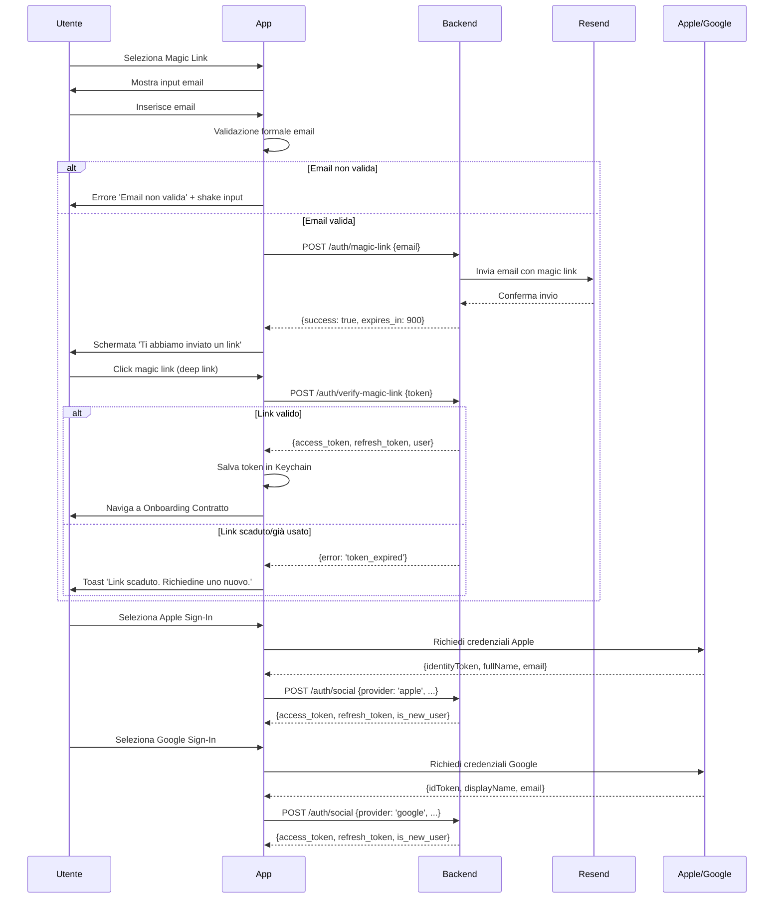

#### Layout Schermata Auth

- **Header**: Logo centrato, padding top 64pt
- **Titolo**: 'Bentornato su CasaGiusta', SF Pro Display / Roboto Bold, 28pt
- **Input email**: border-bottom brand 2px, placeholder #9CA3AF, left-icon ✉️
- **Magic Link CTA**: brand #1B4D7A, cornerRadius 14, shadow, loading spinner su invio
- **Separatore 'oppure'**: linea orizzontale con testo centrato, font 13
- **Apple Sign-In**: sfondo nero, testo bianco. Obbligatorio sopra Google (linee guida Apple)
- **Google Sign-In**: sfondo bianco, bordo grigio
- **Modalità Anonima**: link testuale #6B7280, font 14, padding bottom 32pt

#### Deep Link Handling

- **Schema URL**: `casagiusta://auth/callback?token=xxx`
- **Universal Link (iOS)**: `https://casagiusta.app/auth/callback?token=xxx`
- **App Links (Android)**: `https://casagiusta.app/auth/callback?token=xxx`
- **iOS**: implementare `application(_:continue:restorationHandler:)` e `scene(_:openURLContexts:)`
- **Android**: intent filter per scheme `casagiusta://` e dominio `casagiusta.app`
- **Fallback web**: se app non installata, apre pagina web con redirect allo store

#### Errori e Edge Case

| Errore | Messaggio | Comportamento |
|---|---|---|
| Email non valida | 'Inserisci un indirizzo email valido' | Input shake ±10px, bordo rosso 2s |
| Link scaduto (15 min) | 'Questo link è scaduto. Richiedine uno nuovo.' | Toast bottom, pulsante nuovo link |
| Link già utilizzato | 'Questo link è già stato usato.' | Toast + reindirizzamento |
| Social già associato | 'Account già collegato. Accedi con [provider].' | Precompila login |
| Rate limit (5/10min) | 'Troppi tentativi. Riprova tra X minuti.' | Disabilita input, countdown |
| Offline | 'Connessione necessaria per accedere' | Banner persistente + retry |
| Server error 5xx | 'Qualcosa è andato storto. Riprova.' | Toast con retry automatico 3s |

#### Animazioni Auth Screen

- **Comparsa iniziale**: elementi in sequenza stagger (logo 0ms, titolo 200ms, input 400ms, bottoni 600ms) con fade-in + translateY(30→0)
- **Transizione input → 'Link inviato'**: fade-out input + fade-in icona ✉️, 400ms
- **Shake su errore**: oscillazione ±10px × 3 cicli, 100ms l'uno
- **Loading spinner**: pulsante mostra spinner bianco (rotazione 180°, 1s per giro), input disabilitato

### 1.3 Onboarding Contratto (Post-Auth)

#### Diagramma di Flusso

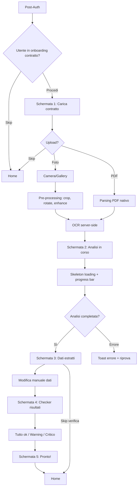

#### Schermata 1: Carica Contratto

- **Header**: NavigationBar trasparente, bottone back, bottone 'Skip' a destra
- **Area upload**: card con bordo tratteggiato 2px, cornerRadius 16, padding 32pt
- **Opzioni**: pulsante 'Seleziona PDF' e 'Scatta una foto', full-width
- **Skip**: salva `onboarding_contract_skipped = true`, mostra banner in Home per 3 giorni

#### Schermata 2: Analisi in Corso

- **Progress bar**: deterministica basata su 4 fasi note
- **Checklist**: ogni fase: ✓ completata, ◌ in corso (pulse), ○ pending (grigio)
- **Stima tempo**: 'Di solito ci vogliono circa 30 secondi'
- **Errore OCR**: 'Non riusciamo a leggere il contratto. Prova con una foto più chiara.'

#### Schermata 3: Dati Estratti

- **Card dati**: ogni campo in groupCard separata con icona
- **Modifica**: tap su card apre bottom sheet con campo editabile
- **Precisione badge**: ✅ alta confidenza (>85%), ⚠️ bassa confidenza (da rivedere)
- **Bottom CTA**: 'Conferma e continua' attivo solo quando tutti i dati critici verificati

#### Schermata 4: Checker Risultati

- **Stati badge**: 🟢 Tutto ok / 🟡 Warning / 🔴 Critico
- **Checklist clausole**: ogni punto verificato con icona ✓ o ✗
- **Espansione**: tap 'Vedi dettaglio' → sheet con spiegazione legale
- **Raccomandazioni**: se critico, mostra azioni consigliate

#### Schermata 5: Pronto!

- **Celebrazione**: confetti animation (80 particelle, 2.5s)
- **Quick actions**: 3 card azione rapida (Chiedi a Giusta, Crea pratica, Vault)
- **CTA finale**: 'Vai alla Home' full-width brand

#### Animazioni

- Schermata 1→2: fade-out contenuti → fade-in skeleton loading
- Progress bar: riempimento 0→100% linear, brand → verde su completamento
- Checklist: fade-in ogni elemento delay 300ms
- Schermata 2→3: slide-up card con stagger 50ms
- Badge risultati: zoom-in 0.5→1.0 spring damping 0.6
- Confetti: 80 particelle, gravità 9.8, durata 2.5s

#### Errori e Edge Case

| Situazione | Comportamento |
|---|---|
| Contratto >20 pagine | Avviso: analisi potrebbe richiedere più tempo |
| PDF criptato | Errore: rimuovi protezione password e riprova |
| Foto troppo scura | OCR fallisce → richiedi nuova foto con buona illuminazione |
| Contratto lingua straniera | Rilevamento lingua → analisi meno accurata |
| Interruzione upload | Ripresa da chunk (resumable upload) |
| File >20MB | 'File troppo grande. Ridimensiona o dividi.' |

### 1.4 Transizione Anonimo → Registrato

#### Diagramma Sequenza

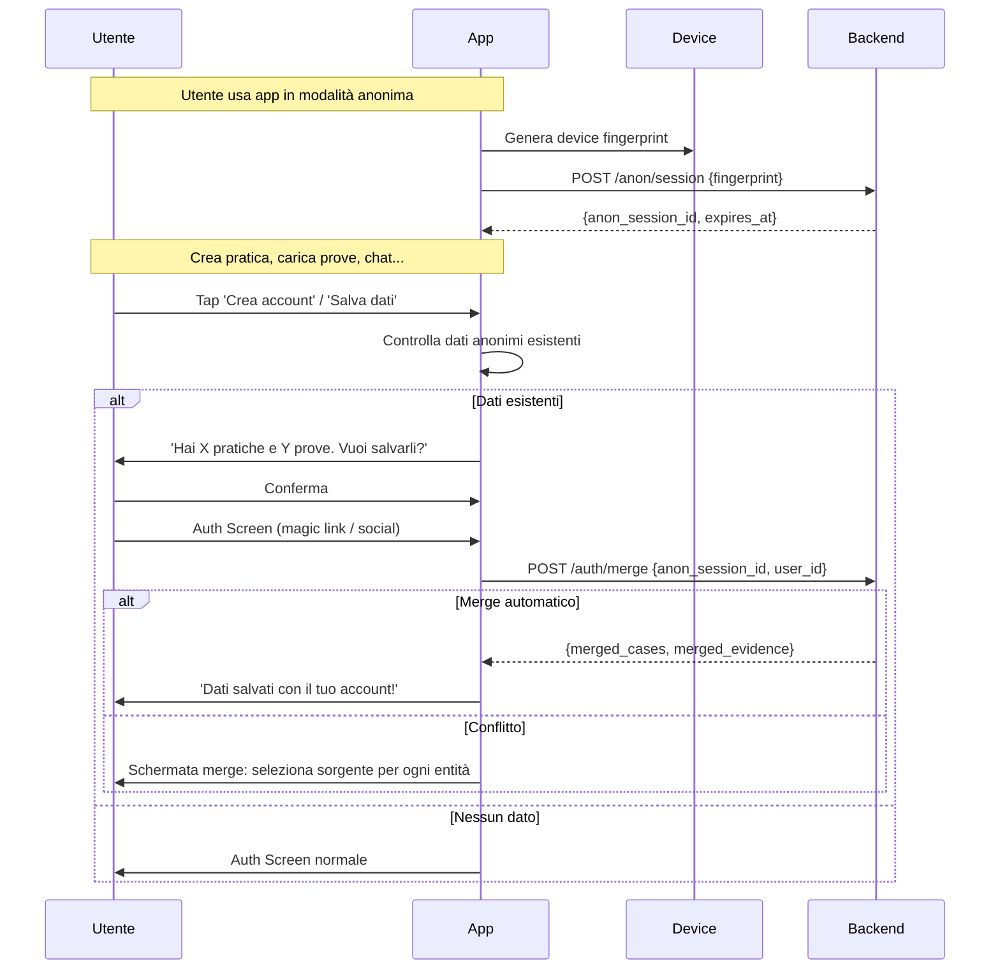

#### Schermata Merge Dati

- **Device fingerprint**: IDFV (iOS) / Advertising ID (Android) + install UUID + hash parametri dispositivo
- **Conservazione dati anonimi**: 30 giorni su server associati a `anon_session_id`
- **Scadenza sessione**: 7 giorni di inattività → TTL cancellation
- **Notifica periodica**: dopo 3 giorni uso anonimo → in-app notification per creare account

#### Errori

- **Merge fallito**: rollback automatico, retry exponential backoff
- **Sessione anonima scaduta (>30gg)**: dati non recuperabili, messaggio chiaro
- **Stesso device, account diverso**: confirm dialog per sostituzione account
- **Dati già mergiati**: non mostrare schermata merge se già completato

---

## FLUSSO 2: Creazione Pratica (Case Tracker)

### 2.1 Selezione Tipo Pratica

#### Diagramma di Flusso

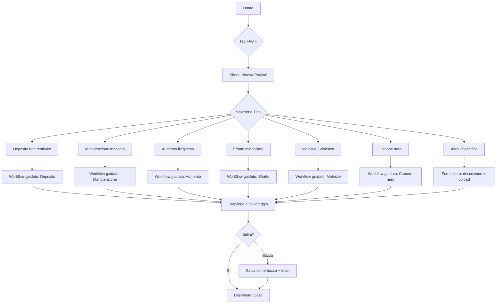

#### Sheet Selezione Tipo

- **FAB**: bottom-right, brand color, ombra, icona +, pulsazione (solo se nessuna pratica attiva)
- **Sheet**: bottom sheet con snap (40% / 80%), drag indicator in alto
- **ListItem**: icona 24pt, titolo Semibold 16pt, sottotitolo Regular 13pt grigio, disclosure indicator
- **Scroll**: se >6 tipi, sheet scrollabile
- **'Altro'**: campo text input in fondo per descrizione personalizzata

#### Animazioni

- **FAB → sheet**: FAB scale 1→0.5, sheet sale translateY(100%→0), 350ms easeOutCubic
- **ListItem tap**: highlight + feedback aptotico (iOS light, Android tick)
- **Sheet → workflow**: sheet scivola giù, nuovo schermo fade-in, 300ms

### 2.2 Workflow Guidato (es. Deposito non restituito)

#### Panoramica Step-by-Step

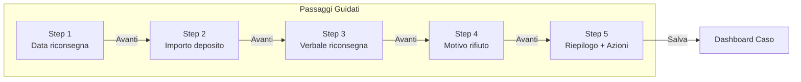

#### Step 1: Data Riconsegna

- **Header**: back button, skip (se opzionale), save draft icon
- **Progress**: barra orizzontale, segmenti, step corrente evidenziato
- **Titolo**: domanda chiara, font 22pt bold, padding 24pt
- **Input**: date picker nativo (iOS UIDatePicker inline, Android MaterialDatePicker)
- **Skip**: salva come 'non fornito'
- **Validazione**: data non futura, non >2 anni fa

#### Step 2: Importo Deposito

- **Input importo**: number pad, formattazione automatica separatore migliaia
- **Stepper mensilità**: custom −/+, min 1, max 6
- **Calcolo automatico**: canone mensile = importo / mensilità
- **Validazione**: importo > 0. Se >6 mensilità → warning 'Il deposito non può superare 3 mensilità (Art. 11 L. 392/78)'

#### Step 3: Verbale di Riconsegna

- **Upload**: foto o PDF, thumbnail con preview
- **Skip**: opzionale, se saltato mostra notifica per allegarlo dopo
- **Consiglio**: 'Se hai il verbale, puoi allegarlo in un secondo momento dalle prove'

#### Step 4: Motivo del Rifiuto

- **Checkbox**: selezione multipla a pill (stile toggle)
- **Testo libero**: multilinea, max 500 caratteri, counter X/500
- **Categorie**: Danni, Pulizie, Bollette, Canoni arretrati, Altro, Non ha spiegato

#### Step 5: Riepilogo e Azioni Consigliate

- **Sezione dati**: recap step con card verticali
- **Azioni consigliate**: 3 card numerate con icona e descrizione
- **Urgenza badge**: 🟢 Bassa / 🟡 Media / 🔴 Alta
- **Scadenza**: calcolata automaticamente, countdown 'X giorni rimanenti'
- **CTA multiple**: Salva, Aggiungi prove, Genera diffida

#### Salva Bozza

- **Automatico**: ogni step salvato su Supabase in background con debounce 2s
- **Ripresa**: 'Riprendi da dove hai lasciato?' con preview ultimo step
- **Scadenza bozza**: notifica push reminder dopo 7 giorni

#### Animazioni Workflow

- **Transizione step**: slide orizzontale (300ms, easeOut)
- **Progress bar**: segmento fill animato 600ms
- **Checkbox**: bounce scale 0.8→1.2→1.0, 300ms
- **CTA finali**: fade-in con delay stagger 100ms

#### Errori

- **Upload fallito**: toast + retry
- **Timeout upload >30s**: progress indeterminato
- **Connessione persa**: salva stato, ripristino quando connessione torna
- **Back durante validazione**: confirm dialog dati persi

### 2.3 Dashboard Caso

#### Layout Dashboard

- **Header**: back + menu opzioni
- **Titolo**: tipo pratica + indirizzo
- **Badge stato**: 🟡 In corso / 🟢 Completata / 🔴 Urgente / ⚪ Bozza / 🔵 In attesa / ⚫ Archiviata
- **Countdown scadenza**: card con timer, se <24h ticking ogni secondo
- **Timeline**: cronologico decrescente, dots colorati, gruppi 'Oggi', 'Ieri', date
- **Azioni rapide**: Contesta, Diffida, Avvocato, Prova
- **Prove collegate**: lista thumbnail + nome, link 'Vedi tutte'

#### Stati Badge

| Stato | Badge | Colore | Descrizione |
|---|---|---|---|
| Bozza | BOZZA | #9CA3AF | Non ancora avviata |
| In corso | IN CORSO | #F59E0B | Attiva, in attesa azioni |
| In attesa | IN ATTESA | #F97316 | Attesa risposta controparte |
| Urgente | URGENTE | #EF4444 | Scadenza imminente/superata |
| Completata | COMPLETATA | #22C55E | Risolta o chiusa |
| Archiviata | ARCHIVIATA | #4B5563 | Archiviata dall'utente |

#### Animazioni

- **Caricamento**: skeleton shimmer (3 card placeholder)
- **Badge stato**: scala 0→1 spring, colore sfumato
- **Countdown**: numeri animati ticking quando <24h
- **Timeline**: slide-in sinistra stagger 50ms

---

## FLUSSO 3: Generazione Diffida

### 3.1 Parametri Richiesti

#### Diagramma Sequenza

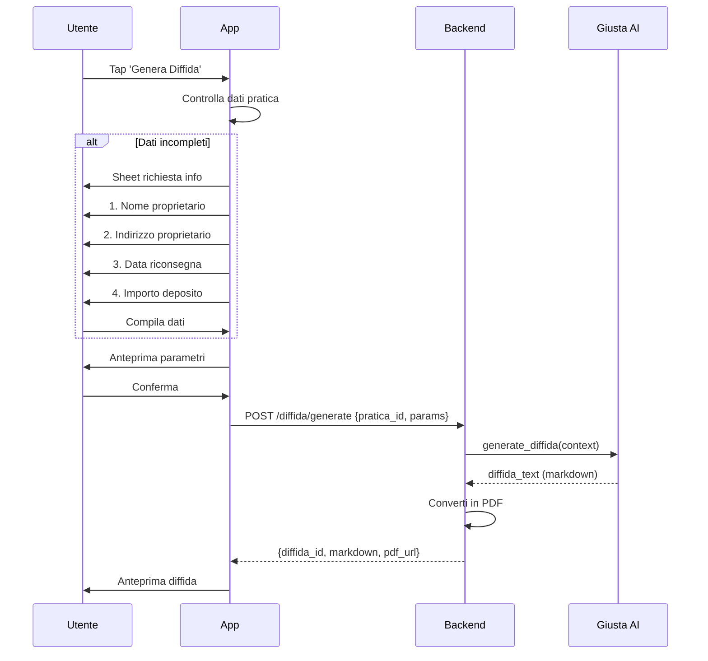

#### Schermata Richiesta Dati

- **Campi precompilati**: dai dati pratica, icona ✅
- **Campi mancanti**: bordo tratteggiato rosso, icona ⚠️
- **Validazione client-side**: nome non vuoto, indirizzo non vuoto, importo > 0
- **Layout**: scroll verticale, ogni campo in card separata

### 3.2 Anteprima e Azioni

#### Schermata Anteprima

- **Preview**: webview nativa PDF (iOS PDFKit / Android PdfRenderer) o rendering markdown
- **Toolbar azioni**: barra orizzontale scrollabile
  - ✏️ Modifica testo
  - 📧 Invia come PEC
  - 📨 Invia via Email
  - 💾 Scarica PDF
  - 🔗 Condividi
- **Stati**: PEC solo se configurata, altrimenti 'Configura PEC'

#### Modifica Testo

- **Editor**: monospaziato font 14, campi dinamici in {{variabile}} evidenziati brand
- **Salva bozza**: su server come bozza diffida
- **Rigenera**: se dati chiave modificati, 'Vuoi rigenerare con i nuovi dati?'

#### Azioni Post-Invio

- **PEC riuscita**: 'Diffida inviata!' + timeline aggiornata + evento
- **PEC fallita**: errore specifico, retry o download PDF per invio manuale
- **Email**: conferma invio + timeline aggiornata
- **Condividi**: share sheet nativo con PDF

### 3.3 Integrazione PEC

#### Schermata Configurazione

- **Campi**: indirizzo PEC, password, server SMTP (autocompila da dominio), porta (default 587)
- **Verifica**: test connessione SMTP, invio email di prova
- **Salvataggio**: credenziali in Keychain/Keystore, mai in plaintext
- **Sicurezza**: app non memorizza password dopo verifica, usa token sessione SMTP
- **Raccomandata A/R**: template PDF per invio postale se non ha PEC

#### Errori PEC

| Errore | Messaggio | Azione |
|---|---|---|
| Credenziali errate | 'Credenziali PEC non valide' | Riapre configurazione |
| SMTP non raggiungibile | 'Server PEC non raggiungibile' | Retry |
| PEC destinatario non valida | 'Indirizzo PEC destinatario non valido' | Modifica indirizzo |
| Limite invio superato | 'Limite giornaliero superato (50)' | Riprova domani |

---

## FLUSSO 4: Vault Prove Digitali

### 4.1 Upload Prova

#### Diagramma di Flusso

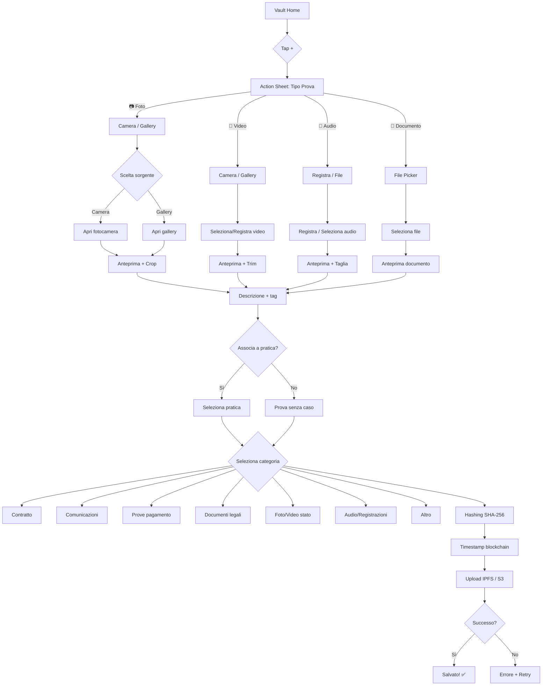

#### Schermate Upload

- **Action sheet**: nativo iOS .actionSheet / Android BottomSheetDialog, 4 opzioni
- **Editor foto**: crop griglia, rotate 90°, filtri base (contrasto, luminosità)
- **Editor video**: trim handle sinistro/destro, durata max 5 minuti
- **Editor audio**: waveform visual, trim handle, play/pause
- **Documento**: preview PDF nativa, nessuna modifica

#### Dettagli Prova

- **Descrizione**: multilinea, max 300 caratteri
- **Categoria**: dropdown 7 categorie
- **Associazione pratica**: dropdown pratiche attive + 'Nessuna'
- **GPS**: toggle, preview mappa se attivo
- **Data**: da EXIF o manuale

#### Hashing e Timestamp

- **SHA-256**: calcolato client-side (Web Crypto / CommonCrypto) prima dell'upload
- **Timestamp**: servizio blockchain (e.g. Ethereum o servizio timestamping italiano)
- **Verifica**: pulsante 'Verifica integrità' → ricalcola e confronta hash

#### Errori Upload

| Errore | Messaggio | Azione |
|---|---|---|
| File troppo grande (foto >25MB) | 'Ridimensiona immagine' | Compress automatico |
| Video >500MB | 'Video troppo lungo. Taglia o comprimi.' | Torna a trim |
| Upload timeout >120s | 'Upload troppo lento' | Riprova con compressione |
| Hash mismatch | 'Errore di integrità' | Re-upload |
| Spazio esaurito (free) | 'Limite 1GB raggiunto. Passa a Pro.' | Sheet upsell |
| GPS non disponibile | 'Verifica permessi' | Continua senza GPS |

### 4.2 Timeline Prove

#### Layout

- **List view**: raggruppamento per data (Oggi, Ieri, 17 Giugno...)
- **Entry row**: icona tipo 24pt + titolo 16pt semibold + data/ora 13pt + caso associato + GPS badge
- **Filtri**: per categoria (checkboxes), per caso (radio), data range
- **Search**: full-text su titolo, descrizione, nome file, debounce 300ms
- **Dettaglio (tap)**: media viewer, hash, timestamp, GPS, azioni (condividi, scarica, elimina)

#### Animazioni

- **Entry slide-in**: fade-in + translateY(20→0), stagger 80ms
- **Filtri sheet**: slide-up 350ms
- **Delete**: swipe-to-delete rosso, undo 3s (tipo Mail)
- **Search**: barra si espande animata

### 4.3 Esportazione Report

#### Schermata Esportazione

- **Selezione**: tutte le prove / solo selezionate
- **Opzioni**: includi hash SHA-256, timestamp, GPS, appendice legale
- **Formato**: PDF / JSON + PDF
- **Struttura report**: copertina → indice → prove (con hash e timestamp) → appendice legale
- **Data Room**: link temporaneo con password, scadenza configurabile (1h, 24h, 7gg)
- **Sicurezza**: accesso tracciato, IP logging, download protetto

---

## FLUSSO 5: Emergency Mode

### 5.1 Attivazione

#### Pulsante Fisso

- **Posizione**: bottom-center, overlay su tutto (z-index più alto)
- **Design**: rosso #DC2626, testo bianco, icona SOS, cornerRadius 28, shadow
- **Visibilità**: sempre visibile, tranne durante chiamate in corso

#### Flow Attivazione

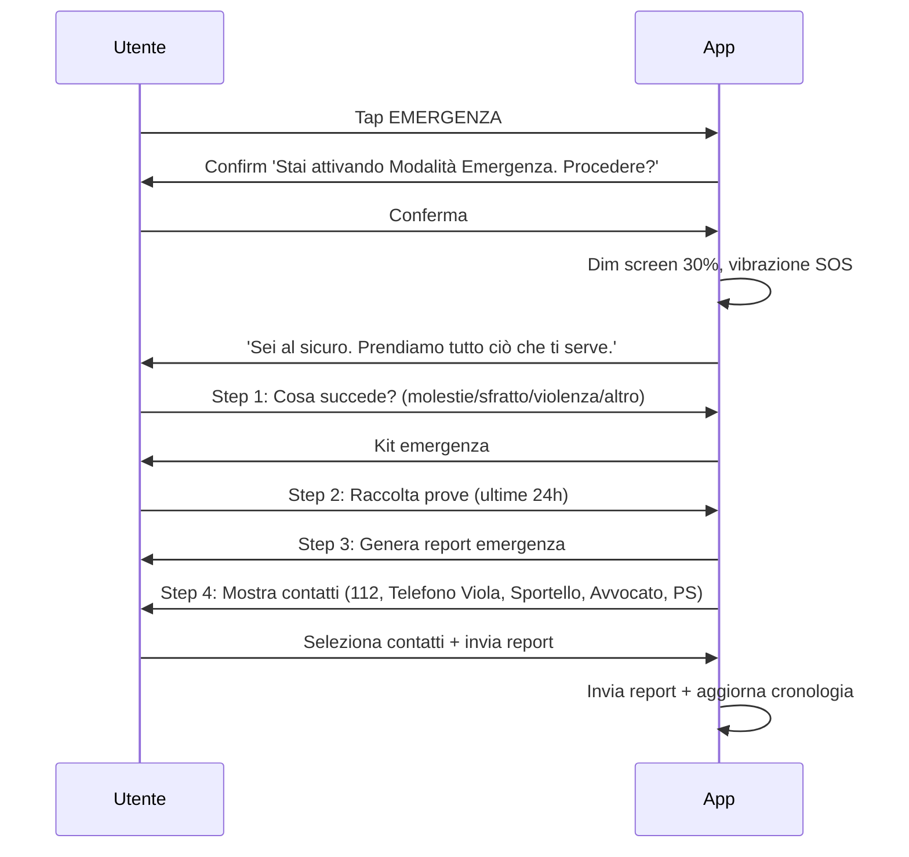

### 5.2 Kit Emergenza

#### Step 1: Cosa Succede

- **Pulsanti grandi**: full-width, padding 20pt, font 18pt bold, colori rosso/arancione
- **Timeout**: se non seleziona dopo 60s, auto-seleziona 'Altro'

#### Step 2: Raccolta Prove Rapida

- **Accesso diretto**: camera/video/audio senza passare da action sheet
- **Salvataggio**: vault con tag 'emergenza', GPS forzato, timestamp forzato
- **Massimo**: 10 foto, 3 video, 5 audio per sessione

#### Step 3: Genera Report

- **Struttura**: dati utente, geolocalizzazione, descrizione evento, prove, timestamp
- **Formato**: PDF ottimizzato per stampa e inoltro
- **Rapido**: <10 secondi

#### Step 4: Contatti

- **Carabinieri 112**: pulsante 'CHIAMA ORA' verde, apre dialer
- **Telefono Viola 1522**: se violenza/molestie selezionato
- **Sportello Casa**: 'Trova sportello' per città
- **Avvocato di turno**: se in matching, nome + orari
- **Pronto Soccorso**: 'Trova PS più vicino'
- **Checkbox invio**: seleziona destinatari report

#### Step 5: Follow-up

- **Invio**: report via PEC/email + backup server
- **Posizione**: condivisa live per 30 minuti (opt-out)
- **Guida sicurezza**: messaggi personalizzati per tipo emergenza
- **Uscita**: disattiva modalità, torna a schermata precedente

#### Animazioni

- **Attivazione**: screen dim 1→0.7 (500ms), vibrazione SOS pattern
- **Pulsante**: pulse 3s scale 1→1.05 + glow rosso
- **Transizione**: slide-up veloce 250ms, senza fronzoli
- **Uscita**: fade-out rosso → fade-in normale (800ms)

#### Errori e Edge Case

| Situazione | Comportamento |
|---|---|
| Offline | Funziona offline, invio rimandato |
| GPS disabilitato | 'Attiva GPS' con link a settings |
| Permessi fotocamera negati | Procede senza foto |
| Falso allarme | Annulla nei primi 5s prima dell'invio |
| Doppia attivazione | 'Aggiornare report esistente?' |
| Batteria scarsa | Disabilita GPS continuo e video |

---

## FLUSSO 6: AI Giusta Chat

### 6.1 Avvio Chat

#### Schermata Chat

- **Top bar**: nome 'Giusta' + avatar circolare 50pt + menu (cronologia, cancella, info)
- **Messaggio benvenuto**: personalizzato con nome utente
- **Quick actions**: 4 card in 2×2 grid:
  - 'Cosa fare se...' → sheet scelta scenario
  - 'Controlla contratto' → carica contratto
  - 'Calcola ISTAT' → calcolatore aggiornamento
  - 'Genera diffida' → shortcut diffida
- **Input fisso**: ancorato a bottom, placeholder 'Chiedi a Giusta...'
- **Keyboard avoidance**: input si sposta sopra keyboard con animazione

### 6.2 Flusso Risposta

#### Diagramma Sequenza

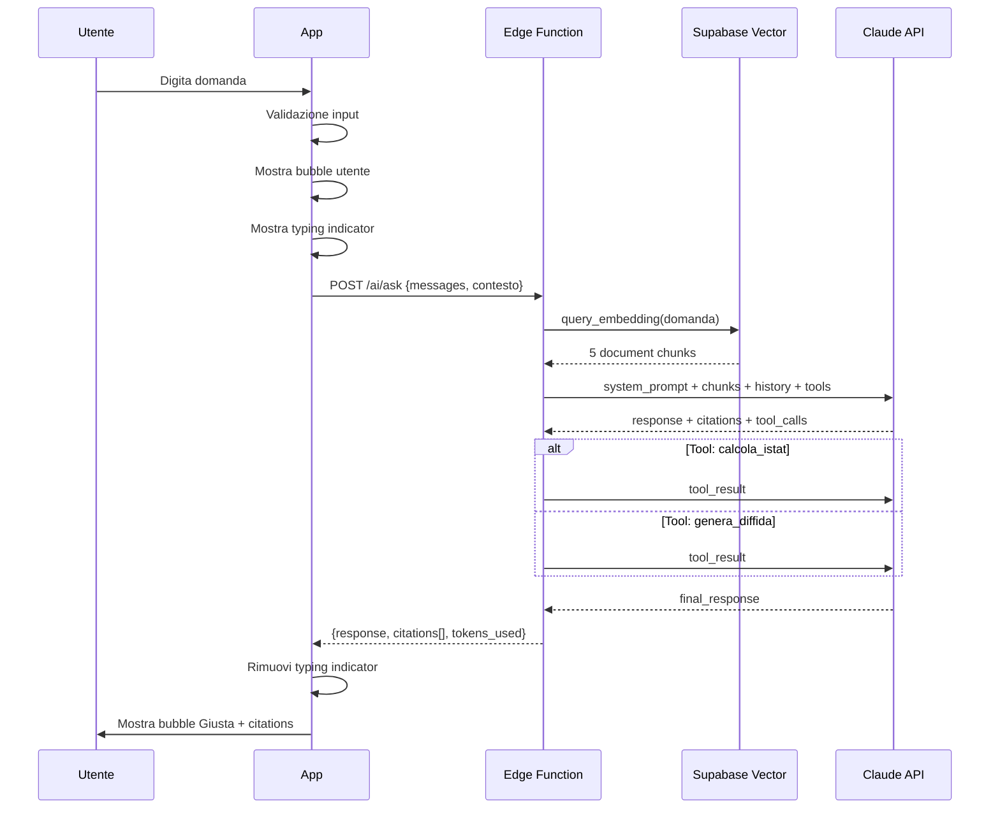

#### Bubble Messaggio

- **Utente**: sfondo brand #1B4D7A, testo bianco, cornerRadius 18 (top-right 4), margin sinistro variabile
- **Giusta**: sfondo #F3F4F6 / #1F2937 (dark), cornerRadius 18 (top-left 4)
- **Timestamp**: font 11, #9CA3AF
- **Check lettura**: doppio check ✓✓ blu
- **Typing indicator**: 3 pallini opacity alternata 0.3–1.0, ciclo 1.2s
- **Inline CTA**: button brand dentro bubble
- **Citations**: [1], [2] inline, brand color, tap expand

### 6.3 Citations UI

- **Espansione inline**: slide-down sotto bubble Giusta
- **Testo norma**: estratto esatto legge in corsivo/virgolette
- **Pulsante**: 'Leggi fonte completa' → webview
- **Multiple**: pill numerate cliccabili, sheet 'Fonti citate' con lista

#### Animazioni Chat

- **Invio**: bubble slide-up + fade-in, 300ms
- **Risposta**: typing 1-8s, poi bubble si sostituisce
- **Citations**: altezza 0→auto spring damping 0.8
- **Auto-scroll**: a fondo su nuovo messaggio
- **Quick actions**: fade-in primo avvio, hover scale 1.02

#### Errori

| Situazione | Comportamento |
|---|---|
| Input vuoto | Send disabilitato |
| Rate limit (20/min free, 100/min pro) | 'Troppo veloce. Aspetta.' + countdown |
| AI timeout >30s | 'Giusta sta impiegando più tempo. Riprova.' + retry |
| AI error | 'Non ho capito. Puoi riformulare?' |
| Sessione scaduta | 'Ricominciamo? Conversazione archiviata.' |
| Fuori scope | 'Posso aiutarti solo con questioni casa.' |
| Rilevamento negatività | Reindirizza a Emergency Mode |
| Messaggio >2000 caratteri | 'Troppo lungo. Scrivi più conciso.' |
| Offline | 'Risponderò appena connesso.' + coda offline |

---

## FLUSSO 7: Matching Avvocato

### 7.1 Ricerca Avvocato

#### Schermata Ricerca

- **Search bar**: icona lente, clear button, cerca città/nome/studio
- **Filtri attivi**: chips rimovibili con X
- **Card avvocato**: foto 60pt, nome + rating stelle, studio, città, specializzazioni tag, disponibilità 🟢/🟡/🔴
- **Paginazione**: 'Carica altri...' con spinner

#### Filtri

- **Città**: scroll list
- **Specializzazione**: checkboxes (Depositi, Sfratti, Contratti, Manutenzione, Mediazione, Canone nero)
- **Disponibilità**: Oggi / Questa settimana / Qualsiasi
- **Pro-bono**: toggle 'Solo pro-bono'
- **Rating minimo**: slider 3.0–5.0

#### Profilo Completo

- **Foto**: 120pt circolare
- **Sezioni**: specializzazioni (tag), tariffe (card), recensioni (ultime 2)
- **Badge**: Pro-bono ✅ verde
- **CTA 'Richiedi Consulenza'**: sticky bottom sempre visibile

### 7.2 Richiesta Contatto

#### Diagramma

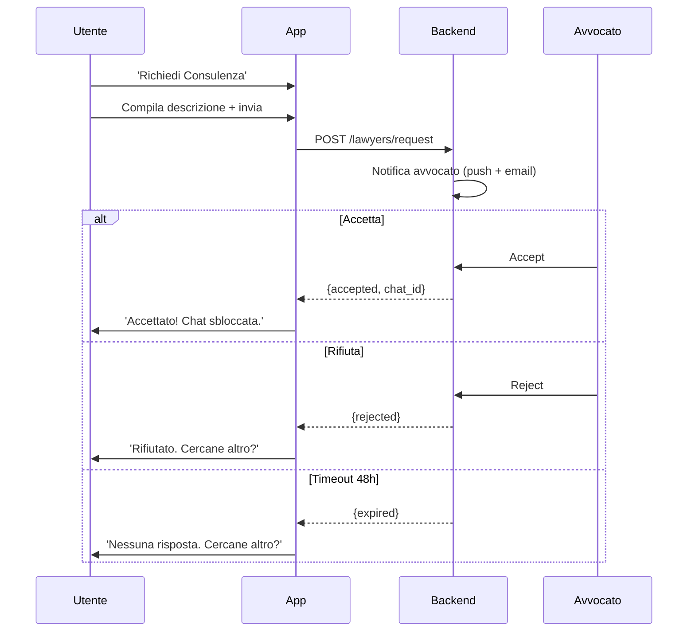

#### Chat Privata

- **Header**: nome + foto + badge 'Verificato'
- **Banner sicurezza**: '🔒 Chat crittografata end-to-end'
- **Condivisione documenti**: crittografati, accesso solo partecipanti
- **Notifiche**: push per nuovi messaggi
- **Archiviazione**: 1 anno dopo chiusura caso

#### Errori

- **Limite richieste**: 3/giorno free, illimitato Pro
- **Avvocato già contattato**: richiesta pendente già esistente
- **Chat scaduta >1 anno**: 'Chat non più disponibile'

---

## FLUSSO 8: Onboarding Avvocato

### 8.1 Registrazione Partner

#### Diagramma di Flusso

```mermaid
flowchart TD
    A[Registrazione] --> C[Step 1: Dati Studio]
    C --> C1[Nome Studio]
    C --> C2[Indirizzo]
    C --> C3[Partita IVA]
    C --> C4[Albo + n. iscrizione]
    C --> D[Step 2: Specializzazioni (max 5)]
    D --> E[Step 3: Documenti]
    E --> E1[Certificato Albo]
    E --> E2[Visura Camerale]
    E --> E3[Documento Identità]
    E --> F[Step 4: Referenze (3)]
    F --> G[Step 5: Tariffe]
    G --> H[Step 6: Profilo Pubblico]
    H --> I[Riepilogo + Invia]
    I --> K{Verifica}
    K -->|OK| L[Pubblicato]
    K -->|Documenti non validi| M[Richiedi correzione]
    K -->|Referenze fallite| N[Supporto]
```

#### Schermate

- **7 step progress**: barra superiore come onboarding contratto
- **Campi obbligatori**: segnati con *
- **Validazione inline**: partita IVA 11 cifre, email valida
- **Upload documenti**: PDF/PNG/JPG, max 10MB per file
- **Verifica backend**: API Agenzia Entrate (P.IVA), API Consiglio Ordine (Albo), OCR documento
- **Tempo stimato**: 2-5 giorni lavorativi

#### Errori

- **P.IVA già registrata**: 'Già associata a un profilo. Contatta supporto.'
- **N. Albo non valido**: 'Verifica i dati di iscrizione.'
- **Documento illeggibile**: 'Carica una versione leggibile.'
- **Email già in uso**: 'Account esistente con questa email.'

---

## FLUSSO 9: Gestione Abbonamento

### 9.1 Passaggio a Pro

#### Schermata Confronto

- **Due colonne**: Free vs Pro, feature confrontate riga per riga
- **Feature Pro**: ✨ evidenziate (pratiche illimitate, 10GB vault, chat illimitata, AI avanzata, diffide, PEC)
- **Offerta annuale**: €39/anno (€3.25/mese, risparmio 35%) con badge 🔥
- **CTA**: 'Passa a Pro €4.99/mese' e 'Passa ad Annuale €39/anno'

#### Pagamento

- **Apple Pay / Google Pay**: pulsanti nativi, priorità su mobile
- **Carta**: Stripe Elements integrato
- **Sicurezza**: badge '🔒 Pagamento sicuro — Stripe'
- **Sblocco**: immediato dopo webhook Stripe → Supabase

#### Downgrade

- **Effetto**: a fine periodo corrente
- **Conservazione dati**: pratiche, prove, chat restano accessibili
- **Feature perse**: diffide, PEC, vault >1GB, chat illimitata, priorità AI

#### Errori

| Situazione | Comportamento |
|---|---|
| Carta rifiutata | 'Transazione rifiutata. Prova altra carta.' + retry |
| Apple Pay non disp. | 'Non disponibile su questo dispositivo.' + carta |
| Downgrade in periodo gratuito | 'Aspetta fine 7 giorni.' |
| Rinnovo fallito | Push + email 'Aggiorna metodo pagamento' |
| Già Pro | 'Sei già Pro. Gestisci da impostazioni.' |

---

## FLUSSO 10: Esportazione Dati (GDPR)

### 10.1 Richiesta Esportazione

#### Schermata

- **Opzioni**: Tutto, Solo contratti, Solo prove, Solo chat, Solo profilo
- **Formato**: PDF + JSON / Solo PDF
- **Email**: precompilata, non modificabile
- **Timer**: 'Riceverai entro 72 ore'
- **Tracking**: ID richiesta #GDPR-XXXX, stato in sezione Privacy

#### Backend Flow

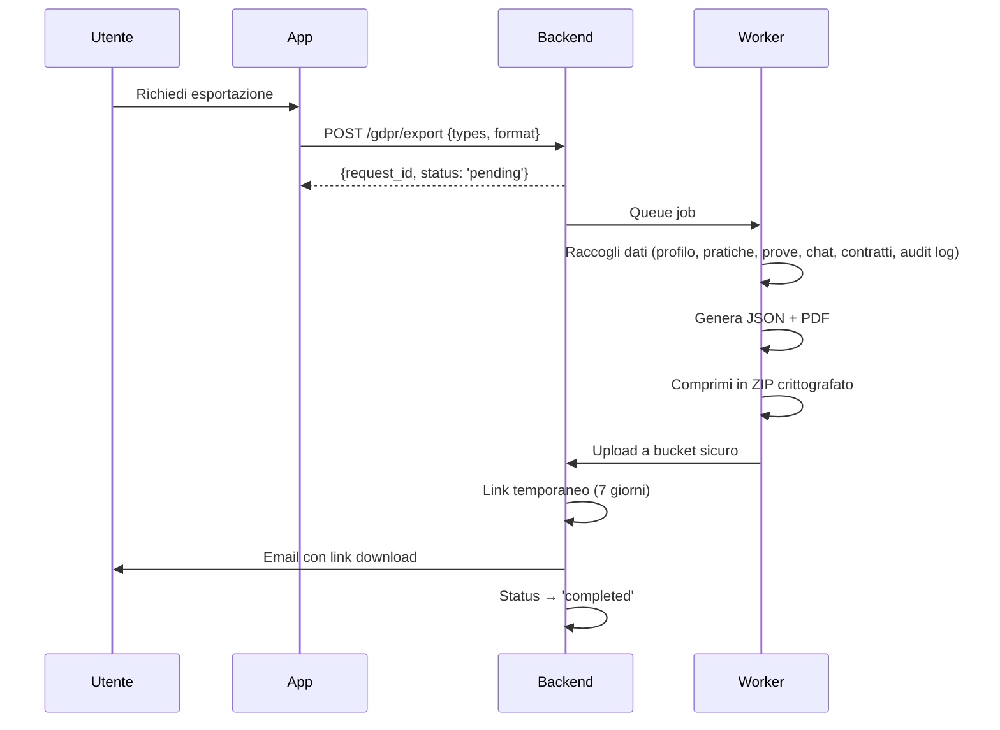

#### Schermata Stato

- **Lista richieste**: ultime richieste con stato
- **Download**: link temporaneo 7 giorni
- **Cancellazione**: possibilità annullare se pending

#### Errori e Edge Case

| Situazione | Comportamento |
|---|---|
| Dati >1GB | 'Riceverai link per download multipli' |
| Richiesta già pendente | 'Hai già una richiesta in corso (#ID)' |
| Limite 1/7 giorni | 'Potrai farne un'altra dal [data]' |
| Email non verificata | 'Verifica email prima di richiedere' |
| Download scaduto | 'Link scaduto (7gg). Richiedi nuova esportazione.' |
| Cancellazione account | 'Vuoi esportare prima di cancellare?' |

---

## Appendice: Pattern Trasversali

### Pattern di Navigazione

| Pattern | Descrizione | Applicazione |
|---|---|---|
| Bottom Sheet | Sheet da basso con snap (40%, 80%) | Selezione tipo, filtri, azioni |
| Push Navigation | Slide da destra | Dettaglio caso, profilo, impostazioni |
| Modal | Full-screen con fade | Auth, Emergency, onboarding |
| Tab Bar | 4 tab fissi basso | Home, Pratiche, Vault, Giusta, Profilo |
| Stepper | Progress bar multi-step | Workflow, onboarding contratto |
| Action Sheet | Lista azioni da basso | Upload, emergenza |

### Pattern di Caricamento

| Stato | UI | Durata |
|---|---|---|
| Skeleton | Placeholder shimmer | 0.5–3s |
| Spinner | Activity indicator | <1s |
| Progress bar | Barra deterministica | Operazioni lunghe |
| Skeleton + progress | Card shimmer + testo | >3s con step noti |

### Pattern di Errore

| Tipo | UI | Comportamento |
|---|---|---|
| Toast | Banner bottom (3s) | Errori lievi, conferme |
| Inline Error | Rosso sotto input | Validazione form |
| Error Banner | Banner persistente alto | Errori rete, offline |
| Modal Error | Dialog centrato con azione | Errori gravi, pagamento |
| Snackbar + Action | Banner bottom + pulsante | Retry, undo |

### Tipi di Notifica

| Tipo | Trigger | Azione tap |
|---|---|---|
| Push: Scadenza | 7/3/1 giorno prima | Apre dashboard caso |
| Push: Risposta avvocato | Accetta/rifiuta richiesta | Apre chat |
| Push: Aggiornamento pratica | Nuovo evento timeline | Apre dettaglio caso |
| Push: Risposta Giusta | Risposta AI pronta | Apre chat |
| In-app: Onboarding | 3 giorni dopo skip contratto | Apre upload contratto |